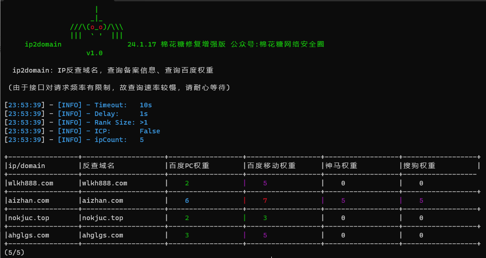
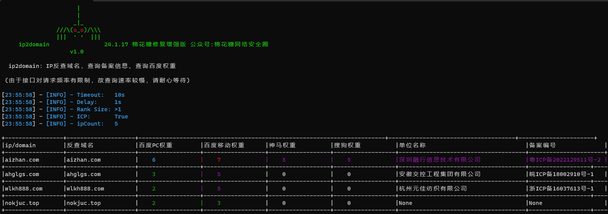
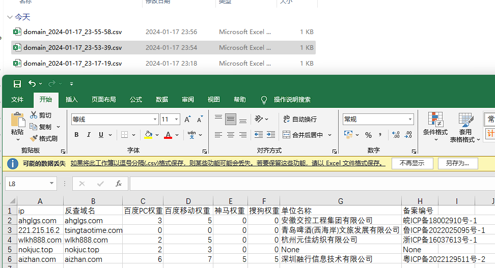

## 🕷ip2domain - 批量查询ip对应域名、备案信息、百度等引擎权重

本工具二开自https://github.com/sma11new/ip2domain

在批量挖SRC时，通常会用较新的漏洞POC批量跑fofa或其他空间测绘的相关资产ip，该工具可用于对跑到的ip批量查询域名及百度权重、备案信息，快速确定ip所属企业，方便提交漏洞。

本来不想重复造轮子的，但查了一圈发现大家都是自己用，接口藏着掖着

所以本项目会一直维护，欢迎大家提交更多接口，一起维护项目

### 😏更新日志：
#### **2025-1-25 `(v1.4)` ：**

修复接口，美化输出

#### **2024-3-29 `(v1.3)` ：**
感谢LuckyRiver99的修复：[issue4](https://github.com/mhtsec/ip2domain/issues/4)

#### **2024-1-19 `(v1.2)` ：**

找接口作者修复了下接口，现在可以用了

多接口版本在做了，避免因为一个接口不稳定导致程序不能用

下个版本增加多接口，大家也整点接口哇

#### **2024-1-19 `(v1.1)` ：**
接口爆掉了，在考虑换回爱站接口或者写多接口版本，如果你有，欢迎提交issues

暂时修复了下因为接口不能获取百度权重而造成不能获取其他权重的bug

新增了360权重，将就还能用

#### **2024-1-17 `(v1.0)`：**

-   在原来的百度PC权重基础上加入百度移动权重、神马权重、搜狗权重，-r可指定显示的权重阈值
-   优化ICP备案查询（默认关闭），--icp开启
-   修复部分问题，替换已失效的接口，减少频率限制

### 🤓参数说明

关键参数是-s、-r、-T和--icp四个：

-   **-s 控制请求时延**，一般1稍快，但偶尔出现请求出错；**2速度适中**，基本不会出现问题；**3最为稳定**，程序挂在后台可稳定输出。
-   **-r 控制百度权重阈值**，0到10代表输出**大于等于**相应百度权重的结果，通常设定为1，可根据需求增减（-1会导致程序出现不可预料的错误）。
-   **--icp 控制是否查询ICP备案信息**，使用该参数即表示开启icp备案查询（默认关闭）。
-   **-T 控制请求延时**，经过测试，接口1延时较大，12以上才能正常，频率可以调低。

所有参数：

```
usage: main.py [-h] [-t TARGET] [-f FILE] [-s DELAY] [-T TIMEOUT] [-r RANK] [-o OUTPUT] [--icp]

optional arguments:
  -h, --help            show this help message and exit
  -t TARGET, --target TARGET
                        Target ip/domain
  -f FILE, --file FILE  指定目标文件，一行一个，ip或者域名
  -s DELAY, --delay DELAY
                        请求延迟 (默认 2s)
  -T TIMEOUT, --Timeout TIMEOUT
                        超时时间 (默认 12s)
  -r RANK, --rank RANK  大于指定的百度权重值则输出，范围0-10 (默认 0)
  -o OUTPUT, --output OUTPUT
                        输出文件 (文件路径： ./output/ip2domain_{fileName}_{date}.csv)
  --icp                 是否开启ICP备案查询 (默认不开启)
```

### 🚩使用示例
python ≥ 3.10

安装依赖：

```
pip install -r requirements.txt
```

将要查询的ip/domain放在txt文件内一行一个，`python main.py -f [file]` 指定，并加入其他参数即可。

**1、**百度权重阈值为1，请求时延为2，不开启ICP备案查询

```
python .\main.py -f E:\Desktop\target.txt -s 2 -r 1
```



**2、**百度权重阈值为1，请求时延为2，开启ICP备案查询

```
python .\main.py -f E:\Desktop\target.txt -s 2 -r 1 --icp
```



结果保存在output目录下csv文件内



### 🚩关注


